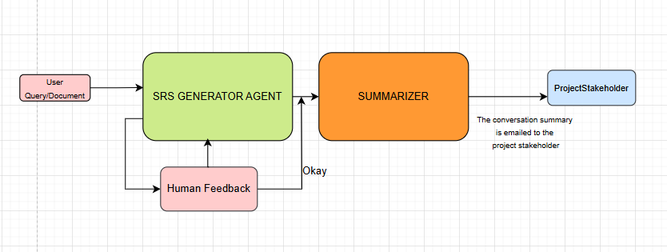

# 🚀 SprintSeed

**AI-powered platform to streamline software planning — from requirement intake to executive-ready summaries.**

---

## 🌍 Overview

SprintSeed is designed to automate and accelerate early-stage software planning. Traditionally, converting a CEO's idea into an actionable plan requires several cycles between the CEO, Business Analysts (BAs), and Project Managers — costing time, effort, and clarity.

SprintSeed reduces this friction by allowing users (e.g., stakeholders, managers, or clients) to upload a prompt or document. AI agents then:

* Understand and translate the input into a structured **Software Requirements Specification (SRS)**.
* Iterate with human feedback for refinements.
* Generate actionable tasks and assign them to developers.
* Email a final summary to stakeholders like the CEO.

⚡ This system has the potential to **replace or assist BAs and PMs** in early planning, offering speed, consistency, and transparency across the team.

---
---

## 🛠️ Installation Guide

Follow the steps below to set up and run SprintSeed locally.

---

### 1. 📥 Clone the Repository

```bash
git clone the repository
cd SprintSeed

## For Backend

cd Backend

pip install -r requirements.txt

run python main.py

Once running, visit:

http://localhost:8000/docs

## For Frontnend

cd Frontend

npm install --legacy-peer-deps

Start Development Server

npm run dev

Once running, go to the given localhost


## 🧠 Agent Flow

```text
1. User submits requirement → (via prompt or document)

2. ➤ SRSCreatorAgent
   - Generates a detailed SRS
   - Supports iterative feedback
   - Finalizes the plan

3. ➤ SummaryAgent
   - Prepares a concise business summary
   - Emails it to the project stakeholder (e.g., CEO)

4. (Planned) ➤ TaskCreatorAgent
   - Breaks down SRS into technical tasks

5. (Planned) ➤ TaskAssignerAgent
   - Assigns tasks based on developer availability and expertise
```

---

## 🛣️ Future Enhancements

* **Task Generation Agent**: Automate ticket creation with effort estimates and technical breakdown.
* **Task Assignment Agent**: Assign tasks using intelligent matching with developer profiles.
* **Multi-Round Human Review**: Optional feedback from PMs or clients at each stage.
* **Third-party Integrations**: GitHub, Jira, Slack, etc.
